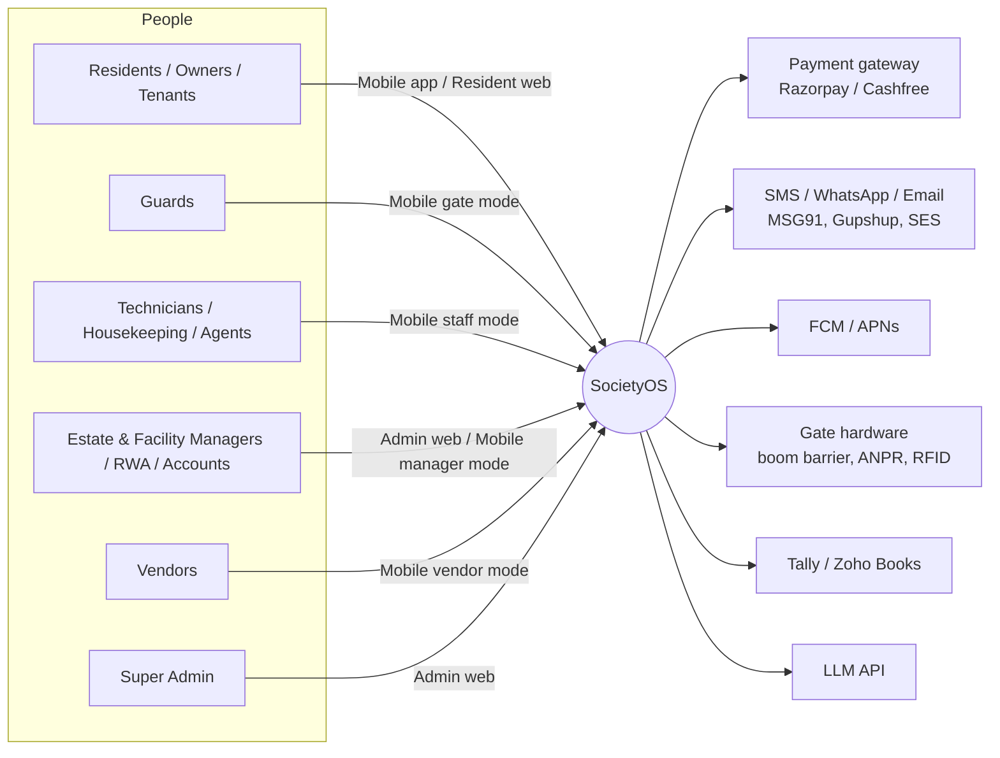
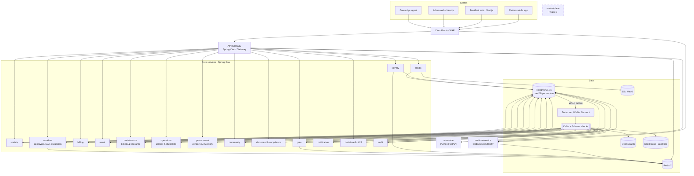

# 00 — Architecture overview

## 1. Goals the architecture must serve

| Goal | Source | Architectural consequence |
|---|---|---|
| Every record links **Asset → Maintenance → Job Card → Cost → History** | Req §52 | Domain events (`jobcard.closed`) fan out to asset history, cost ledger, inventory, complaint |
| Estate Manager answers 5 morning questions **within 60 s** | Req §53 | Dedicated **dashboard read model** (CQRS projection) built from events, not live joins across services |
| Gate approval push to resident **< 3 s p95** | SDD NFR | Realtime service on WebSocket + FCM/APNs; gate path kept short and independent |
| Staff app works **fully offline** in basements/pump rooms | SDD | Mobile outbox + per-service delta-sync APIs with idempotency keys |
| 99.9% for gate & payments, 99.5% rest | SDD / Agreement §8 | Gate and billing isolated as their own services and deployments; no hard runtime dependency on other services |
| Tenant isolation, audit, DPDP 2023 | SDD / Agreement §9–11 | `society_id` on every row + PostgreSQL RLS; immutable audit service; India-only hosting |
| Configurable per society, not coded | SDD | Checklists, PM plans, SLA policies, approval chains stored as data (JSONB + schema) |
| Scale: 50 societies / ~100k residents / 20k gate events per society per day (Phase 2) | SDD | Horizontal stateless services, Kafka partitions, read replicas |

## 2. Architectural style

**Event-driven microservices** on Spring Boot:

- **One service per bounded context**, each owning its PostgreSQL database. No service
  reads or writes another service's tables.
- **Kafka is the backbone** for state changes between services (choreography). Events
  are published with the **transactional outbox** pattern via **Debezium CDC**, so a DB
  commit and its event are never out of step.
- **Synchronous REST** only where the caller needs an answer now (e.g. the gateway
  resolving a permission, the mobile app loading a screen). Service-to-service sync
  calls are the exception and always have a timeout + circuit breaker.
- **Local read models**: a service that needs another service's data (gate needs the flat/resident
  list, maintenance needs asset names) keeps a projection fed by events. That way gate
  keeps working if society-service is down.
- **Redis** handles fast, disposable state: cache, OTP, rate limits, sessions, WebSocket
  fan-out, distributed locks, idempotency keys.

> This replaces the SDD's "modular monolith at MVP" (see [ADR-0001](../adr/0001-event-driven-microservices.md)).
> Cost of the choice: more ops work and more moving parts for a small team. Mitigation:
> one service template with the same platform package in every service ([ADR-0009](../adr/0009-independent-services-netflix-stack.md)), one Helm chart, and everything
> runs locally with a single `docker compose up`.

## 3. System context

## 4. Container view

## 5. Guiding rules (non-negotiable)

1. **Own your data.** One database per service; cross-service data only through events or APIs.
2. **Every change is an event.** Any state change another context may care about is published through the outbox, never with a direct `kafkaTemplate.send()` inside business code.
3. **Consumers are idempotent.** Every consumer records processed event IDs (inbox table). Redelivery must be harmless.
4. **Tenant everywhere.** `society_id` in every row, every event, every log line, every cache key.
5. **Money is `BIGINT` paise.** Never floats. Financial and compliance records are append-only after approval; corrections are reversal entries.
6. **Time is UTC in storage**, society timezone (`Asia/Kolkata` default) for display and schedules.
7. **IDs are UUIDv7** (time-ordered, index friendly), generated in the service. Human-facing numbers (`JC-2026-000123`) come from a per-society sequence.
8. **APIs are contract-first**: OpenAPI per service in `contracts/`, clients generated for Dart and TypeScript.
9. **No service shares a library that contains domain logic.** Services share no code at all; each carries its own platform package (tenancy, outbox, inbox, security, errors, observability).

## 6. Quality attributes → tactics

| Attribute | Tactics |
|---|---|
| Availability | ≥ 2 replicas per service across 3 AZs; Kafka RF=3, `min.insync.replicas=2`; Multi-AZ Postgres; PodDisruptionBudgets; gate has cached read model + edge agent with cached passes |
| Latency | Redis cache on hot reads; projections instead of fan-out queries; WebSocket push; read replicas for reports |
| Consistency | Strong within a service (ACID); eventual across services (typically < 1 s); sagas with compensations for multi-service business actions |
| Scalability | Stateless services behind HPA; Kafka partitions keyed by aggregate id; large tables partitioned by month |
| Security | OAuth2/JWT at gateway **and** service (defence in depth); RLS in DB; mTLS inside cluster (Linkerd) in Phase 2 |
| Evolvability | Versioned APIs (`/v1`), versioned events (`.v1` topic suffix, additive changes only), expand-then-contract migrations |
| Observability | OpenTelemetry traces propagated over HTTP **and Kafka headers**; structured JSON logs with `traceId`, `societyId`, `userIdHash` |
