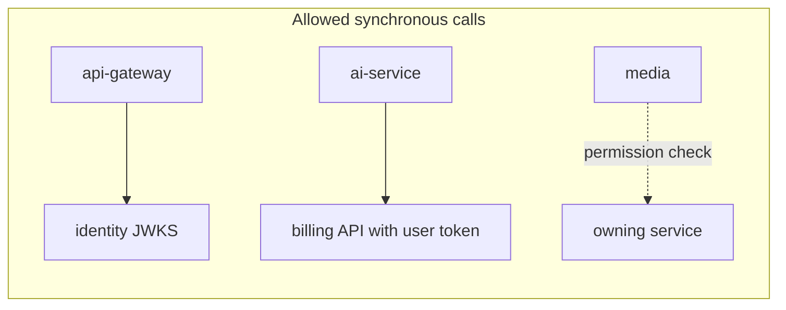

# 01 — Service catalogue

> **Service names (2026-09-28).** Deployable names follow the module boxes of the Solution
> Design v1.0 diagram, and each is an independent project ([ADR-0009](../adr/0009-independent-services-netflix-stack.md)).
> The sections below still use the original bounded-context names; read them with this mapping:
>
> | Diagram box | Service (deployable) | Section below |
> |---|---|---|
> | — (infrastructure) | `service-registry` (Eureka, 8761), `config-server` (8888) | — |
> | Access layer | `api-gateway` (8080) | 0 |
> | Identity | `identity-service` | 1 |
> | Society | `society-service` | 2 |
> | Gate & Security | `security-service` | 3 (gate-service) |
> | Billing | `billing-service` | 4 |
> | Assets & PM | `asset-service` | 5 |
> | Tickets | `ticket-service` | 6 (maintenance-service) |
> | Community | `community-service` | 7 |
> | Workflow + approvals, SLA timers + escalation | `workflow-service` | 8 |
> | Notifications | `notification-service` | 9 |
> | Realtime service | `realtime-service` | 10 |
> | (media for photos/documents) | `media-service` | 11 |
> | Audit log | `audit-service` | 12 |
> | Dashboard / MIS | `dashboard-service` | 13 |
> | Utilities | `utility-service` | 14 (operations-service) |
> | Procurement | `vendor-service` | 15 (procurement-service: vendors, quotes, POs, GRN, invoices) |
> | Inventory | `inventory-service` | 15 (spares, stock, stores split out of procurement) |
> | Compliance | `compliance-service` | 16 (document-service) |
> | AI gateway | `ai-service` (Python) | 17 |
> | Marketplace | `marketplace-service` | 18 |
>
> Kafka topics follow the service names (`sos.security.events.v1`, `sos.ticket.events.v1`, …) and so do event
> types (`security.entry.requested`, `ticket.jobcard.closed`). Exact payloads: [contracts/events/CATALOGUE.md](../../contracts/events/CATALOGUE.md).

18 deployables at full Phase 2 scope: the gateway, 16 Spring Boot services and 1 Python
service. Marketplace (the 19th) is reserved for Phase 3. The pilot (Phase 1) runs 14 of
them (see [11](11-repo-and-build-plan.md)). Each service has its own database, its own
Kafka topic(s), its own OpenAPI spec and its own Helm release.

| # | Service | Port (local) | Database | Kafka topic it publishes | Phase |
|---|---|---|---|---|---|
| 0 | api-gateway | 8080 | — (Redis only) | — | 1 |
| 1 | identity-service | 8081 | `identity_db` | `sos.identity.events.v1` | 1 |
| 2 | society-service | 8082 | `society_db` | `sos.society.events.v1` | 1 |
| 3 | gate-service | 8083 | `gate_db` | `sos.gate.events.v1` | 1 |
| 4 | billing-service | 8084 | `billing_db` | `sos.billing.events.v1` | 1 |
| 5 | asset-service | 8085 | `asset_db` | `sos.asset.events.v1` | 1 |
| 6 | maintenance-service | 8086 | `maintenance_db` | `sos.maintenance.events.v1` | 1 |
| 7 | community-service | 8087 | `community_db` | `sos.community.events.v1` | 1 |
| 8 | workflow-service | 8088 | `workflow_db` | `sos.workflow.events.v1` | 1 |
| 9 | notification-service | 8089 | `notification_db` | `sos.notification.events.v1` | 1 |
| 10 | realtime-service | 8090 | — (Redis) | — | 1 |
| 11 | media-service | 8091 | `media_db` | `sos.media.events.v1` | 1 |
| 12 | audit-service | 8092 | `audit_db` | — | 1 |
| 13 | dashboard-service | 8093 | `dashboard_db` | — | 1 |
| 14 | operations-service | 8094 | `operations_db` | `sos.operations.events.v1` | 2 |
| 15 | procurement-service | 8095 | `procurement_db` | `sos.procurement.events.v1` | 2 |
| 16 | document-service | 8096 | `document_db` | `sos.document.events.v1` | 2 |
| 17 | ai-service (Python) | 8097 | `ai_db` (pgvector) | `sos.ai.events.v1` | 1 (helpdesk) / 2–3 |
| 18 | marketplace-service | 8098 | `marketplace_db` | `sos.marketplace.events.v1` | 3 |

Plus one command topic: `sos.notification.commands.v1`, which any service uses to
ask for a notification to be sent.

---

## 0. api-gateway (Spring Cloud Gateway, reactive)

- Single public entry for REST: `/api/{service}/v1/**` → service.
- Validates JWT (RS256, JWKS from identity-service, cached), rejects expired or revoked
  tokens (Redis deny-list by `jti`).
- Resolves tenant: `X-Society-Id` header must be one of the token's societies; forwards
  `X-Society-Id`, `X-User-Id`, `X-Roles`, `traceparent`.
- Rate limiting: `RequestRateLimiter` with Redis (per user, per IP, stricter on `/auth/otp`).
- CORS for web portals, request size limits, and a circuit breaker per route (Resilience4j).
- **No business logic.**

## 1. identity-service

**Owns:** User, Credential (admin password hash), OtpChallenge (in Redis), Device,
Role, Permission, RoleAssignment (user × society × role), Organisation (FM company),
OrgMembership, Consent, RefreshToken, ServiceClient.

**APIs:** `POST /auth/otp/request`, `POST /auth/otp/verify`, `POST /auth/login` (admin +
MFA TOTP), `POST /auth/token/refresh`, `POST /auth/switch-society`, `POST /auth/logout`,
`GET /.well-known/jwks.json`, `/users`, `/roles`, `/role-assignments`, `/consents`,
`/devices`, `POST /oauth2/token` (client-credentials for service-to-service).

**Publishes:** `user.registered`, `user.updated`, `role.assigned`, `role.revoked`,
`consent.granted`, `consent.withdrawn`, `device.registered`.

**Consumes:** `society.membership.created/ended` → auto-assign/revoke resident role;
`procurement.agent.created` → create staff user.

Permissions are `module:action` strings (`jobcard:approve`, `bill:generate`). Roles are
per-society bundles, editable by the society admin. Default role templates: SUPER_ADMIN,
RWA_COMMITTEE, ESTATE_MANAGER, FACILITY_MANAGER, ENGINEER, TECHNICIAN (plumber,
electrician, fire incharge, carpenter, horticulture, DG operator, lift manager, store
incharge), HOUSEKEEPING, GUARD, ACCOUNTS, VENDOR, RESIDENT_OWNER, RESIDENT_TENANT,
RESIDENT_FAMILY.

## 2. society-service

**Owns:** Society, Tower, Floor, Flat, ParkingSlot, Location (plant rooms, basements,
electrical rooms, common areas), Facility (clubhouse, gym, courts, guest room), Resident
profile, FlatMembership (owner/tenant/family, from–to dates), Vehicle, DomesticStaff,
SocietySettings (timezone, billing config, retention periods), feature flags per society.

**APIs:** `/societies`, `/towers`, `/flats`, `/locations`, `/facilities`, `/members`,
`/vehicles`, `/domestic-staff`, `/directory` (opt-in), `POST /imports` (Excel bulk
onboarding, async, with a validation report).

**Publishes:** `society.created`, `society.settings.updated`, `tower.created`,
`flat.created/updated`, `location.created`, `facility.created/updated`,
`membership.created/ended`, `vehicle.registered/removed`, `domesticstaff.registered/updated`.

## 3. gate-service

**Owns:** Visitor, GatePass (pre-approval with QR/OTP), EntryLog, Delivery,
StaffAttendance (domestic help and society staff), GuardShift, GateDevice, Sos, Incident
(gate side), **read model** `flat_directory` (flat → residents → devices, vehicles,
domestic staff) built from society events.

**APIs:** `/gatepasses` (create, cancel, share), `/entries` (check-in, check-out),
`/entries/{id}/decision` (approve/deny by resident), `/deliveries`, `/staff-attendance`,
`/shifts`, `/sos`, `/edge/sync` (edge agent pulls valid passes, pushes offline entries).

**Publishes:** `gate.entry.requested`, `gate.entry.approved`, `gate.entry.denied`,
`gate.entry.checked_in`, `gate.entry.checked_out`, `gate.pass.created`,
`gate.delivery.arrived`, `gate.sos.raised`, `gate.incident.reported`.

**Consumes:** society membership/vehicle/domestic-staff events (read model);
`marketplace.servicebooking.confirmed` (Phase 3: expected vendor at gate).

Retention: visitor photos and logs purged after the society's configured period
(default 180 days) by a nightly job; `gate.entry.purged` is emitted for audit.

## 4. billing-service

**Owns:** BillingPlan (per-flat charges, area-based or fixed, GST rules, late-fee rule),
BillRun, Bill, BillLine, Payment, PaymentAttempt, Receipt, LedgerAccount, LedgerEntry
(double-entry, append-only), Budget, Expense, CreditNote/Reversal, AutoPayMandate.

**APIs:** `/bill-runs`, `/bills`, `/bills/{id}/pay` (creates a gateway order), `/payments`,
`/receipts/{id}.pdf`, `/ledger`, `/dues`, `/budgets`, `/expenses`, `/exports/tally`,
`POST /webhooks/razorpay` (signature-verified, idempotent).

**Publishes:** `billing.billrun.completed`, `billing.bill.generated`,
`billing.payment.succeeded`, `billing.payment.failed`, `billing.receipt.issued`,
`billing.dues.overdue`, `billing.expense.recorded`.

**Consumes:** `community.booking.confirmed` (booking charge), `maintenance.jobcard.closed`
(recoverable cost → flat bill line or expense), `procurement.invoice.approved` (vendor
payable), `society.flat.*` (billing roster).

GST: the BillingPlan holds GST applicability; the system supports the RWA exemption
threshold (₹7,500 per member per month) and the turnover-threshold flag per society.

## 5. asset-service

**Owns:** AssetCategory (water, electrical, mechanical, vertical transport, fire &
safety, clubhouse/gym, gardening, HVAC), Asset (master record per Req §8, plus the
Equipment Registration form fields: engine/alternator no., breakdown status, maintenance
agency, service entry serial no.), EquipmentSpec (JSONB validated against a category
schema), QrCode, Warranty, AmcContract, AmcVisit, PmPlan (frequency: daily … annual,
or usage-based on a meter), PmTask, AssetHistory (timeline), AssetCost (rolled up),
AssetLifecycleEvent (purchase → install → … → disposal).

**APIs:** `/assets`, `/assets/qr/{code}` (full profile for scan), `/assets/{id}/history`,
`/categories`, `/pm-plans`, `/pm-tasks`, `/warranties`, `/amcs`, `/qr-labels` (PDF sheet),
`/sync/changes`, `/sync/push` (mobile offline).

**Publishes:** `asset.created/updated/disposed`, `asset.status.changed`,
`asset.pmtask.generated`, `asset.pmtask.due`, `asset.pmtask.overdue`,
`asset.warranty.expiring`, `asset.amc.expiring` (at 90/60/30/7 days).

**Consumes:** `maintenance.jobcard.closed` (history + cost + next PM date),
`operations.reading.recorded` (usage-based PM, running hours),
`procurement.vendor.updated` (read model for AMC vendors).

Scheduler: PM generation at 00:30 society-local via **db-scheduler** (clustered on Postgres).

## 6. maintenance-service (tickets, breakdowns, job cards, incidents)

**Owns:** Complaint (resident), Breakdown (P1–P4), Incident (fire, lift entrapment,
flooding, medical, …, with RCA), JobCard (status machine below), JobCardLabour,
JobCardSpareUsage, JobCardEvidence (before/during/after), TicketEvent (history),
Rating, SlaPolicy (per category × priority), CategoryRouting (category → department →
default assignee), **read models**: asset summary and flat directory.

JobCard state machine (Req §11):

```
OPEN → ASSIGNED → IN_PROGRESS ⇄ WAITING (spare | vendor) → COMPLETED → VERIFIED → CLOSED
                     ↑                                           │
                     └──────────── REOPENED ◄────────────────────┘ (resident rejects)
```

**APIs:** `/complaints`, `/breakdowns`, `/incidents`, `/jobcards`,
`/jobcards/{id}/transitions`, `/jobcards/{id}/spares`, `/my-tasks` (technician queue),
`/categories`, `/sla-policies`, `/sync/changes`, `/sync/push`.

**Publishes:** `maintenance.complaint.created`, `maintenance.complaint.resolved`,
`maintenance.complaint.reopened`, `maintenance.breakdown.reported`,
`maintenance.incident.raised`, `maintenance.incident.escalated`,
`maintenance.jobcard.created/assigned/started/waiting/completed/verified/closed`,
`maintenance.rating.submitted`.

**Consumes:** `asset.pmtask.due` (create PM job card), `operations.checklist.item_failed`
(auto-ticket), `gate.sos.raised` (incident), `workflow.sla.breached` /
`workflow.escalated` (reassign + notify), `ai.classification.suggested`,
`procurement.spare.issued`.

## 7. community-service

**Owns:** Notice, Poll, PollOption, Vote (one per flat), Event (festival, sports, blood
donation, plantation, cleanliness drive, AGM), EventRegistration, Volunteer,
EventExpense, FacilityBookingRule, Booking, Classified.

**APIs:** `/notices`, `/polls`, `/polls/{id}/vote`, `/events`, `/registrations`,
`/bookings`, `/facilities/{id}/availability`, `/classifieds`.

**Publishes:** `community.notice.published`, `community.poll.closed`,
`community.event.created`, `community.booking.requested/confirmed/cancelled`.

**Consumes:** `society.facility.*` (read model), `billing.payment.succeeded` (paid bookings).

Booking double-booking protection: Postgres exclusion constraint on
`tstzrange(start_at, end_at)` per facility.

## 8. workflow-service (shared approval, SLA and escalation engine)

**Owns:** WorkflowDefinition (per society, JSON: steps, approver role, amount threshold,
escalate-after-N-hours chain), WorkflowInstance, ApprovalTask, SlaTimer, EscalationLog.

**APIs:** `/definitions`, `/instances`, `/approvals/inbox`, `/approvals/{id}/decide`.

**Publishes:** `workflow.approval.requested`, `workflow.approved`, `workflow.rejected`,
`workflow.sla.warning`, `workflow.sla.breached`, `workflow.escalated`.

**Consumes:** `*.approval_required` style events (e.g. `procurement.po.submitted`,
`billing.expense.submitted`, `maintenance.jobcard.completed` when cost > threshold) and
SLA start/stop events (`maintenance.complaint.created` starts, `…resolved` stops).

Timers: rows in `sla_timer` (source of truth) + db-scheduler one-time tasks at `due_at`.
Survives restarts; no in-memory timers.

## 9. notification-service

**Owns:** Template (per channel, per language: en, hi), Preference (per user, per
category, quiet hours), Notification (outbox of sends), DeliveryAttempt, DeviceToken
(read model from identity), WhatsApp template registry.

**Consumes:** `sos.notification.commands.v1` (explicit send requests) and selected
domain events it maps to templates (e.g. `billing.bill.generated` → "Your bill is ready").

**Channels:** FCM/APNs push, SMS (MSG91), WhatsApp Business (Gupshup / Meta Cloud API),
email (SES), in-app inbox. Channel fallback order is configured per category (gate
approval: push → SMS after 30 s with no response).

**Publishes:** `notification.delivered`, `notification.failed`.

## 10. realtime-service

- WebSocket (STOMP over SockJS fallback) endpoint `/ws`; authenticates with JWT on CONNECT.
- Subscriptions: `/user/queue/gate` (resident approvals), `/topic/society.{id}.gate`
  (guard console), `/topic/society.{id}.alerts` (manager dashboard).
- Consumes gate, maintenance, dashboard and workflow events from Kafka, then fans out to
  whichever instance holds the socket via **Redis pub/sub**.
- Stateless apart from the sockets; scale horizontally.

## 11. media-service

- `POST /uploads` → presigned S3 PUT (15 min, one key, content-type and size limits).
- S3 event → processing: virus scan (ClamAV), EXIF strip (keeps timestamp and geo as
  evidence metadata in the DB), thumbnails, video transcode (Phase 2).
- `GET /media/{id}` → short-lived signed CloudFront URL after a permission check.
- **Publishes:** `media.uploaded`, `media.processed`, `media.rejected`.

## 12. audit-service

- Consumes **all** `sos.*.events.v1` topics. Every event carries actor, action,
  entity, before/after (for audited entities), and is stored in an append-only,
  partitioned table (`audit_log`, monthly partitions, no UPDATE/DELETE grants).
- Hash chain per society (`hash = sha256(prev_hash || row)`) makes tampering evident
  (Agreement §11, §19).
- APIs: `/audit?entity=…&from=…` (admin, RWA), `/exports/audit` for auditors.

## 13. dashboard-service (MIS read model / CQRS)

- Consumes events from all contexts and maintains denormalised tables per society:
  `estate_status` (what is broken), `due_today`, `overdue`, `escalations`,
  `daily_finance` (collections, dues, spend), KPI counters (PM compliance %, MTTR,
  MTBF, uptime, SLA %, collection rate).
- `GET /dashboard/morning` answers the 5 questions in **one query** (< 300 ms).
- Pushes changes to `/topic/society.{id}.alerts` via realtime-service.
- Nightly: publishes the Estate Health Summary request to ai-service (Phase 2).

## 14. operations-service (utilities, readings, checklists, daily rounds) — Phase 2

**Owns:** Meter, Reading (narrow time series: asset, metric, value, unit, at; monthly
partitions) for WTP, STP, DG, transformer, lifts, pumps, tanks, energy and water;
ChecklistTemplate (JSONB items OK / Not OK / N/A), ChecklistRun, ChecklistResponse,
DailyRound (morning/evening), ManagerSignOff, HousekeepingTask, WasteLog (wet, dry,
e-waste, hazardous, garden; vendor, vehicle, quantity), FoggingLog, TankCleaningLog,
GardeningLog.

**Publishes:** `operations.reading.recorded`, `operations.reading.anomaly`,
`operations.checklist.completed`, `operations.checklist.item_failed`,
`operations.signoff.completed`.

## 15. procurement-service (vendors, agents, inventory, purchase) — Phase 2

**Owns:** Vendor (Vendor Registration form: code, address, contact, work scope,
agreement ref and validity, 3-level escalation matrix, ESI/PF compliance, risk, safety
norms, NDA ref, GST/PAN), VendorRateCard, VendorScore (SLA compliance, response and
resolution time, repeat failures), Agent (Agent Profile form: code, role, estate,
reporting manager, in-house or vendor-deployed, ID proof, skills, shift, status),
Requisition, Quotation, QuotationComparison, PurchaseOrder, WorkOrder, Grn,
VendorInvoice, VendorPayment, Spare, StockLevel, StockMovement, Store.

Flow: Requirement → approval → quotations → comparison → purchase approval → PO →
work → GRN → invoice → payment (Req §30). Approvals are delegated to workflow-service.

**Publishes:** `procurement.vendor.created/updated`, `procurement.agent.created/updated`,
`procurement.po.submitted/approved`, `procurement.grn.recorded`,
`procurement.invoice.approved`, `procurement.spare.issued`, `procurement.stock.low`.

**Consumes:** `maintenance.jobcard.closed` (spares consumption reconciliation),
`workflow.approved/rejected`, `maintenance.jobcard.closed` for vendor SLA scoring.

## 16. document-service (documents & statutory compliance) — Phase 2

**Owns:** Document (linked to asset, vendor, compliance item or society), DocumentVersion,
ComplianceItem (lift certificate, fire NOC, electrical inspection, DG/environment, STP
testing, insurance, licences), Certificate (issue and expiry dates).

**Publishes:** `document.uploaded`, `document.compliance.expiring` (90/60/30/7 days),
`document.compliance.expired`. **Consumes:** `media.processed`.

## 17. ai-service (Python FastAPI) — helpdesk in Phase 1

- Society helpdesk: RAG over by-laws, notices and FAQs (pgvector), with citations and a
  per-user permission filter at retrieval time.
- Complaint classification (category, department, priority) → `ai.classification.suggested`.
- Bill explanation (calls billing API with the user's token, never direct DB access).
- Phase 2–3: natural-language admin search, Estate Health Summary, anomaly detection on
  readings, predictive maintenance.
- LLM gateway inside the service: PII redaction before prompts, per-society cost caps,
  prompt and response logging (redacted).
- Consumes `community.notice.published`, `document.uploaded`,
  `maintenance.complaint.created`, `operations.reading.recorded`.
- Any AI action that changes data (booking, raising a ticket) returns a *proposal*; the
  client confirms and calls the owning service itself.

## 18. marketplace-service — Phase 3 (reserved)

ServiceProvider, ServiceCatalogue, ServiceBooking, Order, Offer, Commission. Publishes
`marketplace.servicebooking.confirmed` (consumed by gate for expected entry).

---

## Service dependency rules



Everything else goes through Kafka. If a new synchronous dependency is needed, write an
ADR explaining why an event plus a local read model won't do.
