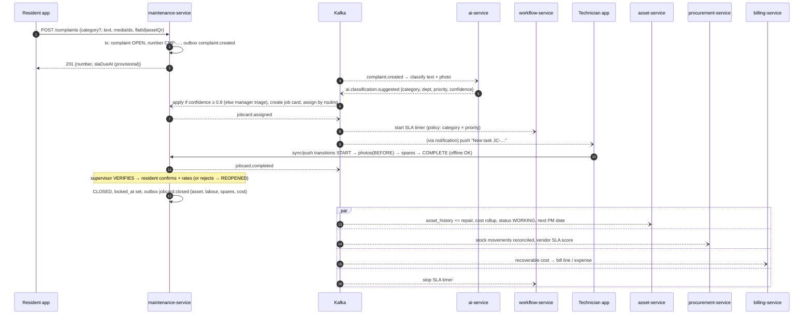

# 06 — Key flows

## 1. Visitor entry (walk-in, needs resident approval) — target < 3 s p95

```mermaid
sequenceDiagram
  autonumber
  participant G as Guard app (gate mode)
  participant GW as api-gateway
  participant GS as gate-service
  participant K as Kafka
  participant RT as realtime-service
  participant N as notification-service
  participant R as Resident app
  participant E as Gate edge agent
  G->>GW: POST /api/gate/v1/entries {flatId, visitor, photoMediaId}
  GW->>GS: forward (JWT ok, society ok)
  GS->>GS: tx: insert entry_log(REQUESTED) + outbox gate.entry.requested
  GS-->>G: 201 {entryId, status: REQUESTED}
  GS--)K: (Debezium) gate.entry.requested
  par
    K--)RT: consume → Redis pub/sub → resident socket
    RT--)R: STOMP /user/queue/gate
  and
    K--)N: consume → FCM/APNs push (high priority)
    N--)R: push "Ramesh (Swiggy) at Gate 1"
  end
  R->>GW: POST /api/gate/v1/entries/{id}/decision {APPROVE}
  GW->>GS: forward
  GS->>GS: tx: status APPROVED + outbox gate.entry.approved
  GS-->>R: 200
  GS--)K: gate.entry.approved
  K--)RT: → guard console socket
  RT--)G: approved ✔
  RT--)E: open barrier (if hardware)
  Note over N: No response in 30 s → SMS/WhatsApp fallback; 3 min → guard may call flat (intercom)
```

**Pre-approved guest (QR/OTP):** the guard scans the QR or types the OTP, and
gate-service validates `gate_pass` locally (valid window, uses left) → `checked_in`.
There is no resident round-trip. The edge agent caches valid passes, so this works offline.

## 2. Complaint to closure (Asset → Job Card → Cost → History)



**SLA breach:** workflow-service's timer fires → `workflow.sla.breached` →
maintenance-service escalates the assignee along the chain (Technician → Facility
Manager → Estate Manager → RWA) and notification-service alerts both the new owner and
the resident. This matches the flowchart's "Escalation (if unresolved / breakdown) →
Estate Manager" loop.

## 3. Preventive maintenance

```mermaid
sequenceDiagram
  participant S as asset-service scheduler (00:30 society time)
  participant K as Kafka
  participant M as maintenance-service
  participant T as Technician app
  participant O as operations-service
  S->>S: for each pm_plan with next_due_on - lead_days ≤ today → pm_task(DUE)
  S--)K: asset.pmtask.due
  K--)M: create job card (source PM, checklist template attached)
  M--)T: appears in My Tasks (push → sync)
  T->>M: executes checklist offline; item "Not OK"
  M--)K: jobcard.closed (+ failed items)
  K--)M: failed item → new breakdown ticket (auto)
  K--)S: pm_task DONE, next_due_on recomputed (calendar or usage)
  Note over S: next day, still not done → asset.pmtask.overdue → dashboard + manager alert
```

Usage-based PM (DG every 250 running hours): `operations.reading.recorded`
(running_hours) → asset-service compares against the plan interval → `pmtask.due`.

## 4. Monthly billing and payment

```mermaid
sequenceDiagram
  autonumber
  participant AC as Accounts (admin web)
  participant B as billing-service
  participant K as Kafka
  participant N as notification-service
  participant R as Resident app
  participant PG as Razorpay
  AC->>B: POST /bill-runs {period 2026-10} (or scheduled)
  B->>B: lock bill-run:{society}; per flat: plan + recurring + booking charges + recoverables + arrears + late fee + GST
  B--)K: billing.bill.generated (per bill), billrun.completed
  K--)N: push + WhatsApp "Your Oct bill ₹4,250 due 10 Oct"
  R->>B: POST /bills/{id}/pay (Idempotency-Key)
  B->>PG: create order
  B-->>R: {orderId, key} → hosted checkout (UPI / card / net banking)
  PG-->>B: webhook payment.captured (HMAC verified, dedup by event id)
  B->>B: tx: payment SUCCEEDED, bill PAID, ledger entries (Dr Bank / Cr Member receivable), receipt RCPT-…
  B--)K: billing.payment.succeeded, billing.receipt.issued
  K--)N: receipt to resident (PDF link)
```

A reconciliation job every 15 minutes fetches the status of gateway orders still
`PENDING` for over 10 minutes, so a lost webhook never leaves a paid bill unpaid.

## 5. Approval with thresholds (PO, major expense)

```
procurement.po.submitted {amount 2,40,000}
  → workflow: definition "PO" → steps: FACILITY_MANAGER (≤ 50k) → ESTATE_MANAGER (≤ 2L) → RWA_COMMITTEE (> 2L, 2 of 5 members)
  → approval_task per step; escalate a step after 24 h with no decision
  → workflow.approved → procurement: PO APPROVED → vendor emailed PO PDF
```

## 6. Daily estate sign-off (Phase 2)

Morning and evening rounds: checklist templates per area (water, pumps, WTP/STP, DG,
transformer, lifts, basement, housekeeping, garbage, security) → responses with photo
evidence → failed items auto-raise tickets → the Estate Manager signs off in manager mode
→ `operations.signoff.completed` → dashboard shows "Signed 07:42 by …".

## 7. Mobile offline sync (technician in a basement)

See [08](08-mobile-flutter.md#offline-sync-protocol). Short version: local Drift DB +
outbox → `POST /api/{svc}/v1/sync/push` (batch, one idempotency key per change) →
`GET /sync/changes?cursor=` → field-level merge; locked records take the server version.
