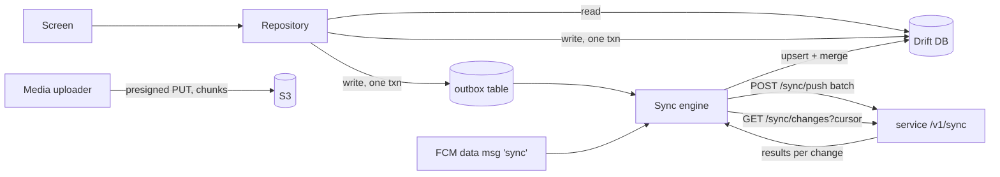

# 08 — Mobile app (Flutter)

One Android + iOS app. After login, the user's roles decide which **mode** opens:
resident, gate, technician, housekeeping, manager or vendor. A user who has more than
one role (for example a resident who is also on the RWA) can switch modes from the profile.

## 1. Stack

| Concern | Choice |
|---|---|
| Framework | Flutter 3.x (Dart 3), min Android 8 (API 26), iOS 15 |
| State | Riverpod 2 (code-gen `@riverpod`) |
| Navigation | go_router with role-guarded route trees |
| HTTP | dio + interceptors (auth refresh, `X-Society-Id`, `Idempotency-Key`, tracing); clients generated from OpenAPI (`openapi-generator` dart-dio) |
| Local DB | Drift (SQLite) with SQLCipher encryption |
| Secure storage | flutter_secure_storage (Keystore / Keychain) for tokens and DB key |
| Realtime | stomp_dart_client over WebSocket |
| Push | firebase_messaging (FCM, APNs via FCM), flutter_local_notifications with a high-priority "gate" channel |
| QR / camera | mobile_scanner, camera, image compression (flutter_image_compress) |
| Background | workmanager (periodic sync), background_fetch on iOS |
| Payments | Razorpay Flutter SDK (hosted checkout) |
| i18n | flutter_localizations + ARB files: `en`, `hi` |
| Monitoring | Firebase Crashlytics, Performance; Sentry optional |
| Tests | flutter_test, mocktail, integration_test, Maestro flows |

## 2. Project structure (feature-first)

```
apps/mobile/
  lib/
    main.dart
    app/            router.dart, theme/, l10n/, mode_selector.dart
    core/
      api/          dio client, interceptors, generated clients (packages/api_client)
      auth/         otp login, token store, device binding
      db/           drift database, tables, DAOs
      sync/         sync engine, outbox, cursors, conflict rules
      media/        capture, compress, resumable upload
      realtime/     stomp client, subscriptions
      push/         FCM setup, notification routing (deep links)
      tenancy/      active society, society switcher
    features/
      resident/     home, gate (passes, approvals, history), pay, help (complaints, QR fault), community, assistant
      gate/         console, check-in, pass scan, deliveries, staff attendance, sos, shift
      technician/   my_tasks, job_card flow, asset_scan, readings, spares
      housekeeping/ checklists, attendance
      manager/      morning dashboard, approvals, escalations, daily sign-off
      vendor/       assigned jobs, amc visits, invoices
    shared/         widgets (design system), formatters (₹, dates IST)
  test/, integration_test/
```

Each feature folder contains `data/` (repository, DAO, API adapter), `application/`
(Riverpod notifiers) and `presentation/` (screens, widgets).

## 3. Mode UX highlights

- **Resident:** five tabs (Home, Gate, Pay, Help, Community), with the AI assistant FAB on
  every tab. Gate approval arrives as a full-screen notification with Approve / Deny
  that works from the lock screen.
- **Gate (guard):** large targets, one-hand use, Hindi first. Big buttons: *Visitor*,
  *Delivery*, *Scan pass*, *Staff*, *SOS*. Works on low-end phones and the gate tablet
  (kiosk mode via Android lock task).
- **Technician:** My Tasks → Start → Work → Photo → Complete → Submit (Req §43). Scanning
  a QR code opens the asset profile.
- **Manager:** a morning card stack for the five questions, and an approvals inbox.

## 4. Offline sync protocol

Offline-capable features: job cards, PM tasks, checklists, readings, spare-issue
requests, housekeeping tasks, and asset profiles (read). **Not** offline: gate approvals,
SOS, payments. Those need the live API and are blocked with a clear "no connection" state.



**Outbox row:** `{changeId (UUIDv7) = Idempotency-Key, service, entity, entityId, op, patch (changed fields only), baseVersion, createdAt, attempts}`.

**Push:** `POST /api/maintenance/v1/sync/push`

```json
{ "deviceId": "…", "changes": [
  { "changeId": "…", "entity": "jobCard", "id": "…", "op": "transition",
    "payload": { "action": "START", "at": "2026-09-28T05:02:11Z" }, "baseVersion": 3 },
  { "changeId": "…", "entity": "jobCardEvidence", "id": "…", "op": "create",
    "payload": { "jobCardId": "…", "stage": "BEFORE", "mediaId": "…", "lat": 28.6, "lng": 77.3 } }
]}
```

The server answers per change: `APPLIED` (new version), `DUPLICATE` (idempotent replay),
`CONFLICT_MERGED`, or `REJECTED` (with reason, e.g. `JOBCARD_LOCKED`, `INVALID_TRANSITION`).

**Pull:** `GET /sync/changes?cursor=…&entities=jobCard,pmTask,asset` returns rows
changed since the cursor. The cursor is the service's monotonic change sequence per
society + user scope. Paged, max 500.

**Conflict rules:**
1. Status transitions are validated by the server's state machine, never merged. If the
   server says `INVALID_TRANSITION` the local row is replaced by the server row and the
   user sees a banner.
2. Plain fields (notes, readings): field-level last-writer-wins by the client `at`
   timestamp, within a 24 h clock-skew guard.
3. Locked records (verified/closed job cards, signed-off checklists): the server version
   always wins.
4. Offline creates use client-generated UUIDv7, so there is no ID remapping.

**Triggers:** app foreground, connectivity regained, FCM data message
`{"type":"sync","scope":"jobCard"}`, and every 15 min in the background. Target: synced
within 60 s of reconnect.

**Media:** captured → compressed (≤ 1600 px, JPEG 75) → stored locally → `POST
/api/media/v1/uploads` → presigned multipart PUT (resumable) → `mediaId` attached to the
outbox change. Changes that depend on media wait until the upload finishes.

## 5. Security on device

- DB encrypted with SQLCipher; key in Keystore / Keychain.
- Certificate pinning for `api.societyos.in` (with a backup pin).
- Root/jailbreak detection only warns (guards often have old phones), but gate mode
  requires a registered device.
- A logout wipes the local DB and outbox once pending changes are synced or explicitly discarded.
- Screenshots are blocked on payment and ID-document screens.

## 6. Release

Codemagic (or Fastlane on GitHub Actions) → Firebase App Distribution / TestFlight →
Play closed track → staged rollout. Two-week release train. Minimum version is enforced
via Remote Config; server-side feature flags switch features on without a new build.
