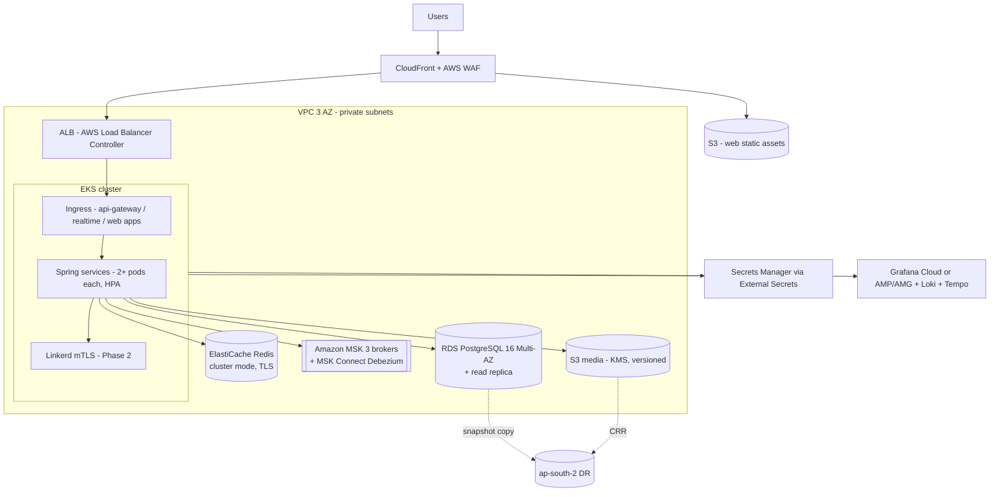
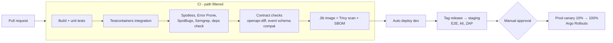

# 10 — Infrastructure and DevOps

## 1. Environments

| Env | Where | Purpose | Data |
|---|---|---|---|
| `local` | Developer laptop, Docker Compose | Build and debug one or more services | Seed data (`infra/docker/seed`) |
| `dev` | EKS namespace `sos-dev` (shared cluster) | Integration of `main`, PR preview apps | Synthetic |
| `staging` | EKS namespace `sos-staging` (prod-like sizing, 1/4 scale) | Release candidates, E2E, load tests, ZAP scan | Anonymised copy of pilot data |
| `prod` | Dedicated EKS cluster, ap-south-1, 3 AZs | Customers | Real; DR copy in ap-south-2 |

All environments are India-hosted ([05](05-security-tenancy.md#5-data-protection-dpdp-act-2023--rules-2025-agreement-912)).

## 2. Local stack (`infra/docker/docker-compose.yml`)

One command brings up everything the services need:

```
docker compose -f infra/docker/docker-compose.yml up -d
```

| Container | Image | Port | Notes |
|---|---|---|---|
| postgres | `postgres:16` | 5432 | `wal_level=logical`; `init/` creates one DB + `<svc>_owner` / `<svc>_app` roles per service |
| redis | `redis:7` | 6379 | |
| kafka | `apache/kafka:3.8.x` | 9092 (host), 29092 (in-network) | Single broker, KRaft, auto-create **off** |
| kafka-init | same as kafka | — | Runs `create-topics.sh` once |
| connect | `quay.io/debezium/connect:2.7` | 8083→18083 | Debezium Postgres connector; `register-connectors.sh` posts one outbox connector per service DB |
| kafka-ui | `provectuslabs/kafka-ui` | 8180 | Browse topics, DLQs |
| minio | `minio/minio` | 9000 / 9001 | S3 for media-service |
| mailpit | `axllent/mailpit` | 1025 / 8025 | Catches e-mail |
| otel-lgtm | `grafana/otel-lgtm` | 3000, 4317/4318 | Grafana + Tempo + Loki + Prometheus in one container |

Services run from the IDE or with `./mvnw spring-boot:run` in the service folder and use the
`local` Spring profile (connection strings to `localhost`). Without Debezium running,
set `SOS_OUTBOX_RELAY=polling` to use the platform's polling relay (see [02](02-events-kafka.md#4-publishing-transactional-outbox--debezium)).

Seed data: one demo society (2 towers, 40 flats, residents, guard, technician, estate
manager) loaded by `infra/docker/seed/seed.sh` through the public APIs, not SQL, so it
exercises the same events as production.

## 3. Production topology (AWS, ap-south-1)



| Component | Starting size | Scaling |
|---|---|---|
| EKS nodes | 3 × `m7g.xlarge` (Graviton) on-demand + Karpenter spot pool for stateless pods | Karpenter |
| RDS | `db.r7g.large` Multi-AZ + 1 read replica, gp3 | Vertical; hot services move to own cluster |
| MSK | 3 × `kafka.m7g.large`, 3 AZ, RF 3 | Add brokers / partitions |
| ElastiCache | 1 shard × 2 replicas `cache.r7g.large` | Add shards |
| Pods | 2 replicas min per service (3 for gate, gateway, realtime) | HPA on CPU + Kafka consumer lag (KEDA) |

Infrastructure is code: **Terraform** modules in `infra/terraform` (`network`, `eks`,
`rds`, `msk`, `elasticache`, `s3`, `cloudfront`, `iam`), one state per env in S3 + DynamoDB lock.

## 4. Kubernetes packaging

- One generic Helm chart `infra/helm/sos-service` for every Spring service: Deployment,
  Service, HPA, PDB (`minAvailable: 1`), ServiceMonitor, ExternalSecret, NetworkPolicy
  (deny all, allow gateway → service, service → data), and a pre-upgrade Flyway `Job`.
- Per-service values in `infra/helm/values/<service>.yaml` (port, replicas, resources, DB name, topics).
- Probes: `/actuator/health/liveness`, `/actuator/health/readiness` (readiness includes
  DB and Kafka; liveness does not, to avoid restart storms).
- Graceful shutdown: `server.shutdown=graceful`, 30 s `terminationGracePeriodSeconds`;
  Kafka consumers stop polling before the pod exits.
- **GitOps with Argo CD**: `infra/k8s/apps/<env>/` holds Argo `Application`s; CI bumps
  image tags in Git, Argo syncs. No `kubectl apply` from CI.

## 5. CI/CD (GitHub Actions)



| Workflow | Trigger | Does |
|---|---|---|
| `service-<name>.yml` (one per service) | changes in `services/<name>/` or its contracts | `./mvnw verify -Pintegration` (Testcontainers), JaCoCo, image for that service only |
| `web.yml` | `apps/*-web`, `packages/` | `pnpm turbo lint test build`, Playwright against mocks |
| `mobile.yml` | `apps/mobile` | `flutter analyze`, `flutter test`, build APK/IPA (Fastlane) on tags |
| `ai.yml` | `ai-service/` | ruff, mypy, pytest, image |
| `contracts.yml` | `contracts/` | Regenerate Dart/TS clients, fail if generated code differs; schema compatibility |

Release: trunk-based, short-lived branches, semantic version tags per service
(`gate-service/v1.4.0`). Database migrations always run before the new pods, and must be
backward compatible with the previous release (expand then contract).

## 6. Observability

| Signal | How |
|---|---|
| Traces | OpenTelemetry Java agent-free (Micrometer Tracing + OTLP); `traceparent` carried in HTTP and Kafka headers; Tempo |
| Metrics | Micrometer → Prometheus; standard RED metrics per endpoint, Kafka consumer lag, outbox backlog, Hikari pool |
| Logs | JSON (logstash encoder) → Loki; every line has `traceId`, `societyId`, `userIdHash`; no PII |
| Dashboards | Per service (RED + JVM), Kafka (lag per group, DLQ size), business (gate approvals/min, bill runs, payments) |
| Alerts | Grafana alerting → PagerDuty/Opsgenie |

Service-level objectives (from Agreement §8):

| SLO | Target | Alert when |
|---|---|---|
| Gate approval end-to-end p95 | < 3 s | p95 > 3 s for 10 min |
| Gate + payments availability | 99.9% monthly | burn rate 14× over 1 h |
| Other APIs availability | 99.5% monthly | burn rate 14× over 1 h |
| Event propagation (outbox → consumer) | p95 < 2 s | consumer lag > 1,000 or outbox backlog > 500 for 5 min |
| DLQ | 0 unhandled | any message in `sos.dlq.*` |

## 7. Backup, DR and business continuity

| Item | Mechanism | RPO / RTO |
|---|---|---|
| PostgreSQL | RDS PITR 14 days; daily snapshot copied to ap-south-2 | RPO 15 min / RTO 4 h |
| Kafka | Not a system of record; topics recreated from Terraform, consumers rebuild read models from Postgres snapshots (`sos.society.snapshots.v1` compacted) | — |
| Redis | Disposable; no backup | — |
| S3 media | Versioning + cross-region replication | RPO 15 min |
| Config / infra | Git (Terraform, Helm, Argo) | Rebuild region in < 4 h |

A DR drill runs quarterly: restore RDS in ap-south-2, apply Terraform, switch DNS, run the
smoke suite. Gate edge agents keep working offline through a region outage (cached passes,
queued entries).

## 8. Security operations

- Private subnets only; the database, Redis and Kafka have no public endpoints.
- IRSA (IAM roles for service accounts) — each pod gets only its own S3 prefix / secret.
- Image signing with cosign; Kyverno admission policy allows only signed images from our ECR.
- WAF managed rules + rate rules on `/api/identity/v1/auth/otp/*`.
- GuardDuty, CloudTrail, VPC flow logs → SIEM. Security events from audit-service also go there.
- Break-glass access: SSO + MFA, time-boxed, logged (Agreement §11).

## 9. Cost (Phase 1 pilot, indicative)

| Item | Monthly (USD, approx.) |
|---|---|
| EKS control plane + 3 nodes | 350 |
| RDS Multi-AZ + replica | 450 |
| MSK 3 brokers | 500 |
| ElastiCache | 200 |
| S3, CloudFront, data transfer | 100 |
| Observability | 150 |
| **Total** | **≈ 1,750** |

Cheaper pilot option (documented in [ADR-0002](../adr/0002-kafka-as-event-backbone.md)):
self-hosted Kafka (Strimzi, 3 small brokers on EKS) instead of MSK saves about 350 USD a month.
